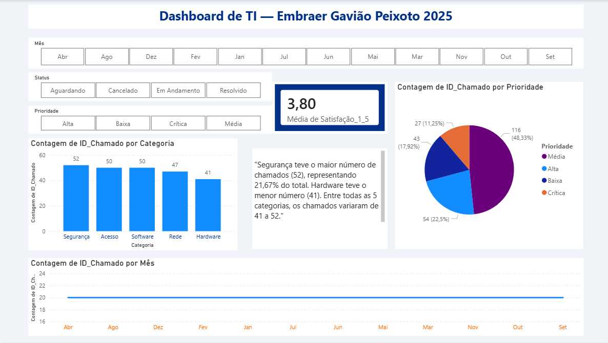

📊 Dashboard de TI — Embraer Gavião Peixoto 2025

Projeto de análise de dados com dashboard interativo desenvolvido em Power BI com recursos de Inteligência Artificial e filtros interativos, utilizando dados simulados de chamados de TI de uma unidade aeronáutica.

👨‍💻 Sobre o Autor
José Luís França
Estudante de Ciência de Dados — Univesp
Graduado em Tecnologia da Informação — Univesp
📍 São Paulo, Brasil
🔗 github.com/jlfranca-data

🎯 Objetivo do Projeto
Desenvolver um dashboard de Business Intelligence para monitoramento e análise dos chamados de TI de uma unidade fabril aeronáutica, aplicando conceitos de análise de dados, visualização interativa e inteligência artificial.

🛠️ Ferramentas Utilizadas
FerramentaFinalidadeMicrosoft Power BI DesktopCriação do dashboard e visualizaçõesPower BI — Narrativa Inteligente (IA)Geração automática de insights com IAPower BI — SegmentadoresFiltros interativos por Mês, Status e PrioridadeMicrosoft Excel (.xlsx)Base de dados estruturadaPython + openpyxlGeração e formatação da base de dadosGitHubVersionamento e publicação do projeto

📁 Estrutura do Projeto
painel-ti-embraer/
│
├── 📊 Dashboard_TI_Embraer.pbix          # Arquivo do dashboard Power BI
├── 📂 dados/
│   └── Embraer_TI_Dashboard_Dados.xlsx   # Base de dados com 4 abas
├── 📂 imagens/
│   └── dashboard_preview.png             # Print do dashboard
└── 📄 README.md                          # Documentação do projeto

⚠️ Aviso sobre os Dados

Os dados utilizados neste projeto são totalmente fictícios, gerados com fins educacionais e de aprendizagem. Não representam dados reais da Embraer ou de qualquer outra organização.

📋 Sobre os Dados
A base de dados contém 4 tabelas com dados simulados:
TabelaRegistrosDescriçãoChamados_TI240 linhasChamados com categoria, prioridade, status, tempo de resolução e satisfaçãoIndicadores_Mensais12 linhasResumo mensal com taxa de resolução e SLAInventário_Ativos80 linhasEquipamentos de TI com valor e garantiaEquipe_TI8 linhasAnalistas com especialidade e avaliação

📈 Visualizações do Dashboard

Gráfico de barras — Total de chamados por categoria com rótulos de valor no topo
Gráfico de linha — Evolução mensal dos chamados ao longo de 2025
Gráfico de pizza — Distribuição por prioridade (Crítica, Alta, Média, Baixa)
Cartão KPI — Média de satisfação dos usuários (escala 1 a 5)
Narrativa Inteligente (IA) — Insights gerados automaticamente pelo Power BI

🎛️ Filtros Interativos
O dashboard conta com 3 segmentadores interativos que atualizam todos os visuais simultaneamente:

Mês — Filtra os dados por mês do ano
Status — Filtra por status do chamado (Resolvido, Em Andamento, Aguardando, Cancelado)
Prioridade — Filtra por nível de prioridade (Crítica, Alta, Média, Baixa)

🤖 Recurso de IA Aplicado
O dashboard utiliza o recurso nativo de Narrativa Inteligente do Power BI, que analisa os dados automaticamente e gera descrições em linguagem natural destacando padrões, variações e pontos de atenção — sem necessidade de programação adicional.

🚀 Como Visualizar o Projeto

Baixe o arquivo Dashboard_TI_Embraer.pbix
Abra com o Power BI Desktop (gratuito em powerbi.microsoft.com)
Os dados já estão incorporados — o dashboard carrega automaticamente
Use os filtros de Mês, Status e Prioridade para explorar os dados

📚 Contexto Acadêmico
Este projeto foi desenvolvido como portfólio para ingresso na graduação em Ciência de Dados pela Univesp, demonstrando proatividade e aplicação prática antes mesmo do início do curso:

Análise e visualização de dados
Business Intelligence (BI)
Inteligência Artificial aplicada a dados
Filtros e interatividade em dashboards
Documentação técnica de projetos

📬 Contato

🔗 GitHub: github.com/jlfranca-data
📧 E-mail: jlfranca.data@gmail.com
